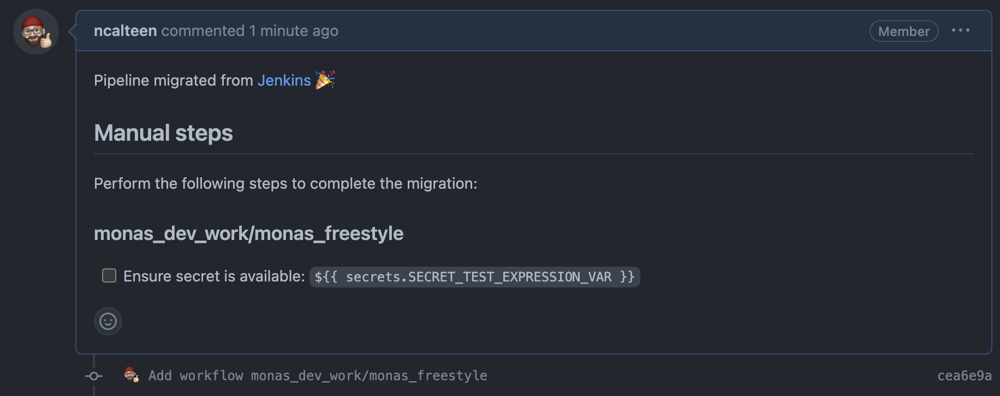

# Perform a Production Migration

In this lab, you will use the `migrate` command to convert a Jenkins pipeline
and open a pull request with the equivalent Actions workflow.

## Step 1: Perform a migration

When running a migration, the following inputs must be provided:

| Option         | Description                                          | Example                                                        |
| -------------- | ---------------------------------------------------- | -------------------------------------------------------------- |
| `--target-url` | URL to the GitHub repository where the PR is created | `https://github.com/:owner/:repo`                              |
| `--output-dir` | Output path for logs and artifacts                   | `tmp/migrate`                                                  |
| `--source-url` | URL to the source Jenkins pipeline                   | `http://localhost:8080/job/monas_dev_work/job/monas_freestyle` |

1. Open a new terminal window
2. Run the following command

   ```bash
   gh actions-importer migrate jenkins --target-url https://github.com/ncalteen-migrations/actions-importer-lab --output-dir tmp/migrate --source-url http://localhost:8080/job/monas_dev_work/job/monas_freestyle
   ```

The command will write the URL to the pull request that is created.

```bash
$ gh actions-importer migrate jenkins --target-url https://github.com/:owner/:repo --output-dir tmp/migrate --source-url http://localhost:8080/job/monas_dev_work/job/monas_freestyle
[2022-08-20 22:08:20] Logs: 'tmp/migrate/log/actions-importer-20220916-014033.log'
[2022-08-20 22:08:20] Pull request: 'https://github.com/:owner/:repo/pull/1'
```

## Step 2: Inspect the Pull Request

1. Open the generated pull request in a new browser tab

   The first thing you should notice about the pull request is that there is a
   list of manual steps to complete.

   

2. Create the `SECRET_TEST_EXPRESSION_VAR` and mark it as complete in the PR

3. Click the "Files changed" tab

   In this PR, you will see a new workflow being created,
   `.github/workflows/monas_freestyle.yml`. If you need to make changes,
   discuss, or get reviews, you can do so within this PR.

4. Click the "Conversation" tab
5. Click "Merge pull request"

   Once the PR is merged, the new action will be available.

6. Click the "Actions" tab to see the newly-created workflow
